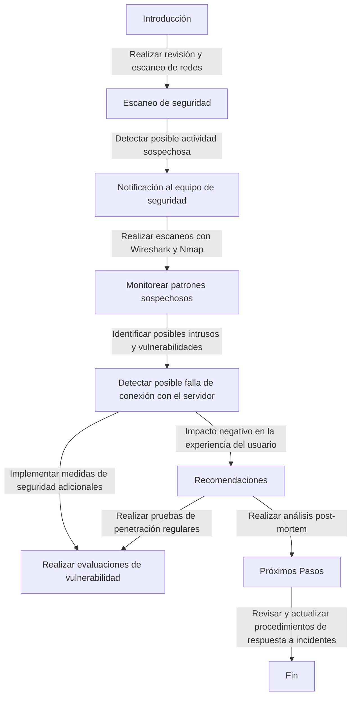

**INFORME DE Evaluación DE SEGURIDAD**
===========================================================


### Introducción
Este informe se realiza de forma preventiva para hacer una revisión y escaneo de redes a la página de Garras y Tuercas, Esto se realizara ya que al llegar a ser presentado como proyecto internacional para Chile-méxico, se debe asegurar que la pagina es segura y que no habrá problemas con tener más usuarios a un nivel internacional, tratando de cumplir con los estándares de seguridad en todo momento.


### Fecha de Informe:
10/08/2024


### PERSONA DE CONTACTO
----------------------


* **Nombre Completo:** Sebastian Avila
* **Dirección:** Garras y Tuercas HQ
* **Título del Puesto:** Experto en ciberseguridad
* **Teléfono:** (+569) xxxxxxxx
* **Correo Electrónico:** xxxx@gmail.com


### EL INCIDENTE
----------------


* **Fecha del Incidente:** 12/08, 2024
* **Hora:** 10:30 [x] AM [ ] PM
* **Tipo de Incidente:** [ ] Malware [ ] Brecha de Datos [x] Otro: se realizan escaneos en búsqueda de actividad sospechosa o dispositivos comprometidos.


### NOTIFICACIÓN
----------------


* **¿Se notificó a otros empleados?:** [x] Sí [ ] No
* **Sí sí, ingrese:** Se informó al equipo de seguridad.


### CONTENCIÓN
----------------


* **¿Se tomaron medidas de contención?:** [] Sí [x] No
* **Si sí, describa:**


### SERVICIOS AFECTADOS
----------------------


* **¿Se vio afectado permanentemente algún servicio por el incidente?:** [] Sí [x] No
* **Si sí, describa:**


-----------------------------------------------------------


### IMPACTO DE LA INFORMACIÓN
----------------------


* **¿Se vio comprometida alguna información, registro o dato?:** [ ] Sí [x] No
* **Si sí, describa:** Posible detección de intrusos y vulnerabilidades en la página.


### OTROS
---------


* **¿Hay alguna otra información que desee incluir en este informe?:** [x] Sí [ ] No
* **Si sí, describa:** Se realizaron escaneos con wireshark y Nmap para monitorear en búsqueda de patrones sospechosos o dispositivos potencialmente comprometidos.


### USO EXCLUSIVO DE LA OFICINA
-------------------


* **Informe recibido por:** Christofer Espinoza
* **Fecha:** 12/08, 2024
* **Acción de seguimiento tomada:**


* **Detección:** Nuestro equipo de seguridad realizar escaneos con nmap y wireshark y aunque no parece haber conexiones no deseadas o posibles dispositivos comprometidos, si se observan unos pocos errores que indican una posible falla de conexión con el servidor lo cual resultará en una pérdida de servicio momentánea lo cual impacta de forma negativa la experiencia del usuario.


```
### Recomendaciones


* implementar medidas de seguridad adicionales para prevenir posibles ataques Dos.


* Realizar evaluaciones de vulnerabilidad y pruebas de penetración regulares para identificar posibles puntos de entrada para malware.


### Próximos Pasos


* Realizar un análisis post-mortem exhaustivo de la respuesta a incidentes para identificar áreas de mejora.


* Revisar y actualizar los procedimientos de respuestas a incidentes para asegurar una respuesta oportuna efectiva a futuros incidentes.


  ```

